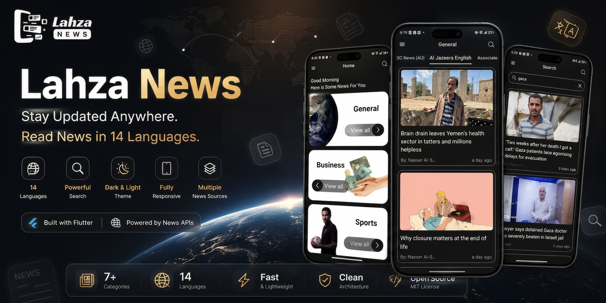
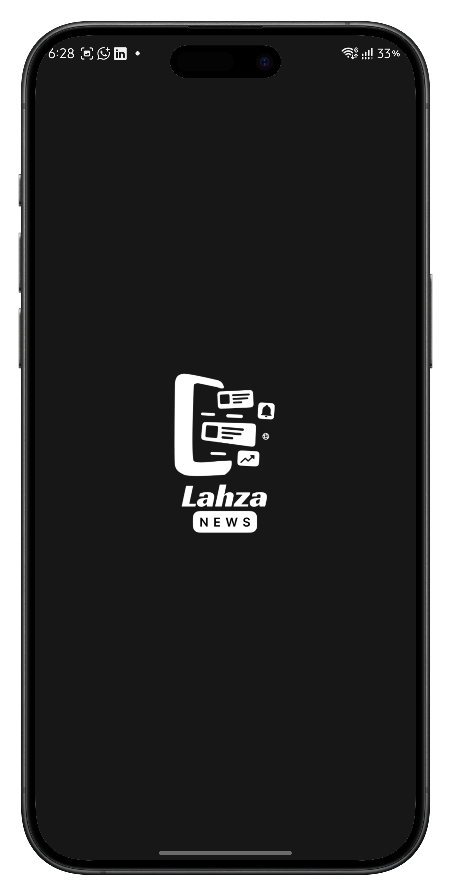
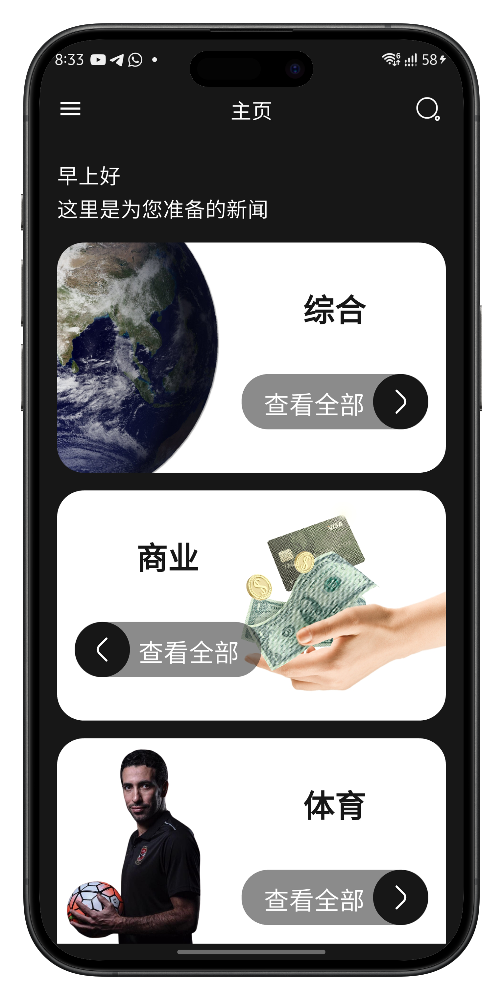
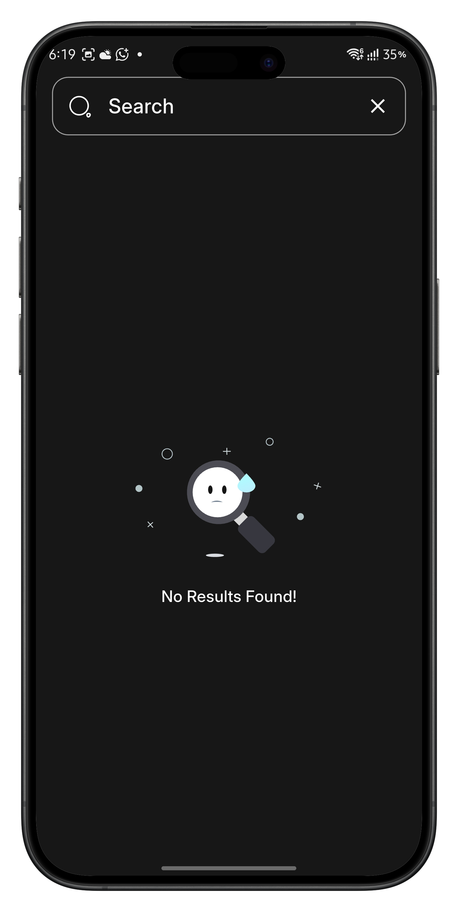
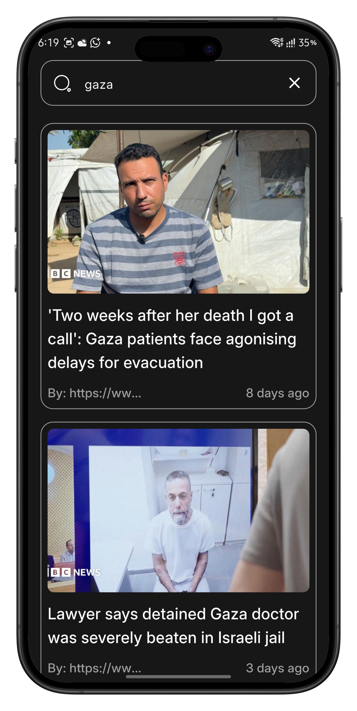
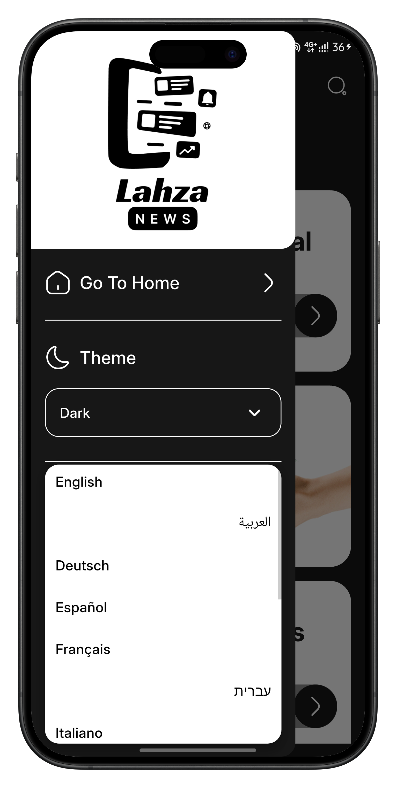
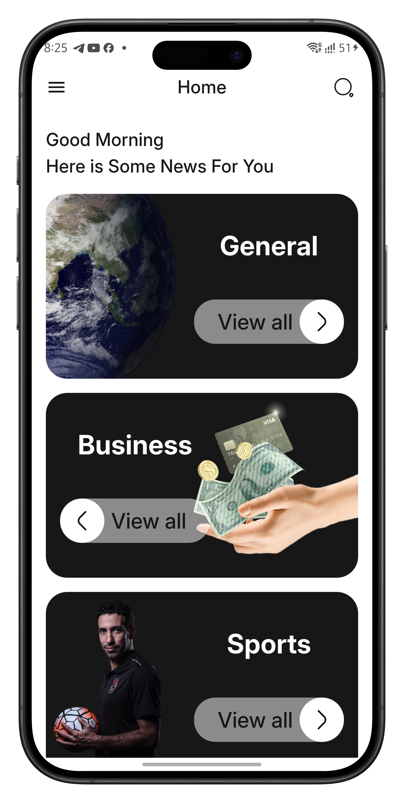
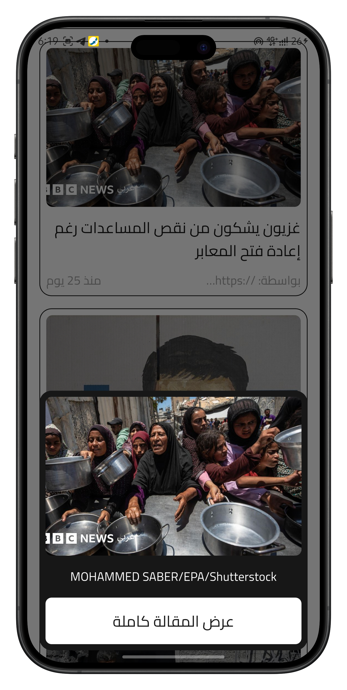
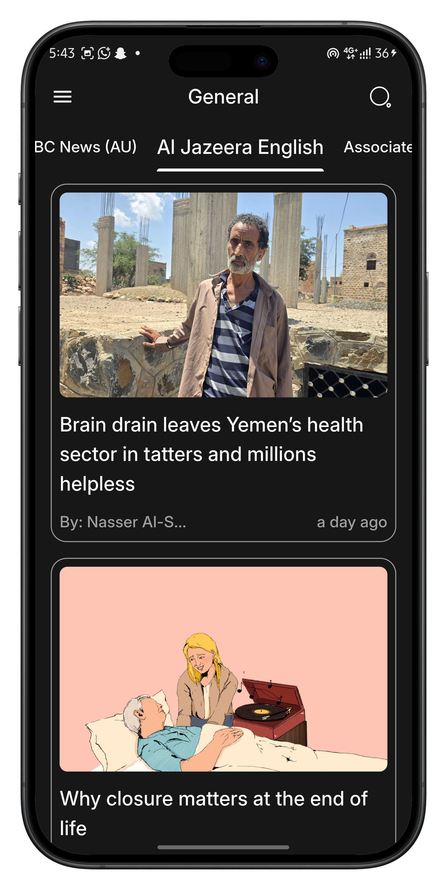

<div align="center">


# 📰 Lahza News

### Stay Updated. Anywhere. Anytime.

A modern Flutter news application that delivers the latest news from trusted global sources with **14 language support**, **powerful multilingual search**, **Light & Dark themes**, and a beautiful responsive user experience.



<br>


</div>

---

# 📖 Overview

**Lahza News** is a modern Flutter news application that provides users with instant access to the latest news from trusted international sources.

The application focuses on delivering a smooth reading experience through a clean interface, multilingual support, powerful search functionality, responsive layouts, and beautiful light and dark themes.

Whether you're interested in sports, business, entertainment, science, health, or general news, Lahza News keeps everything organized and accessible in one place.

---

# ✨ Features

- 🌍 Support for **14 Languages**
- 🔍 Search news using keywords in any supported language
- 📰 Browse news from trusted global news sources
- 📂 Multiple news categories
- 🌙 Light & Dark Mode
- 📱 Fully Responsive UI
- ⚡ Fast & Smooth Performance
- 🖼 Cached Images
- 📄 Article Details Bottom Sheet
- 🎨 Modern Material Design
- 🔄 Real-time API Integration

---

# 🗂 News Categories

- 📰 General
- 💼 Business
- ⚽ Sports
- 🎬 Entertainment
- ❤️ Health
- 🔬 Science
- 💻 Technology

---

# 🌍 Supported Languages

- 🇺🇸 English
- 🇸🇦 Arabic
- 🇫🇷 French
- 🇩🇪 German
- 🇪🇸 Spanish
- 🇮🇹 Italian
- 🇵🇹 Portuguese
- 🇷🇺 Russian
- 🇹🇷 Turkish
- 🇨🇳 Chinese
- 🇯🇵 Japanese
- 🇰🇷 Korean
- 🇮🇳 Hindi
- 🇵🇰 Urdu

---

# 📱 Screenshots

## 🚀 Splash Screen

<p align="center">

</p>

---

## 🏠 Home

<p align="center">



</p>

---

## 🔍 Search

<p align="center">


</p>

---

## 📄 Article Details

<p align="center">

</p>

---

## 🌍 Language Selection

<p align="center">

</p>

---

## ☀️ Light Theme

<p align="center">



</p>

---

## 🌙 Dark Theme

<p align="center">



</p>

---

# 🏗 Architecture

The project follows a clean and scalable structure to make development and maintenance easier.

```text
lib
│
├── core
├── data
├── presentation
├── models
├── services
├── localization
└── main.dart
```

---

# 🛠 Tech Stack

- Flutter
- Dart
- Providers
- REST API
- Localization
- Shared Preferences
- Cached Network Image
- Responsive UI
- Material Design

---

# 🚀 Getting Started

### Clone the repository

```bash
git clone https://github.com/mohamedismail-dev/lahza_news.git
```

### Navigate to the project

```bash
cd lahza_news
```

### Install dependencies

```bash
flutter pub get
```

### Run the application

```bash
flutter run
```

---

# 📂 Project Structure

```text
lib/
│
├── core/
├── data/
├── models/
├── presentation/
│   ├── screens/
│   ├── widgets/
│   └── bloc/
├── localization/
└── main.dart
```

---

# 🚀 Future Improvements

- ⭐ Bookmark Articles
- 🔔 Push Notifications
- ❤️ Favorite News
- 📖 Offline Reading
- 👤 User Authentication
- 📜 Reading History
- 🤖 AI News Recommendations
- 📊 Trending News
- 📤 Social Sharing Improvements

---

# 👨‍💻 Developer

### Mohamed Ismail

**Flutter Developer & UI/UX Designer**

- GitHub: https://github.com/mohamedismail-dev
- LinkedIn: https://www.linkedin.com/in/mohamedismail-dev

---

<div align="center">

### ⭐ If you found this project useful, don't forget to star the repository!

Made with ❤️ using Flutter

</div>
